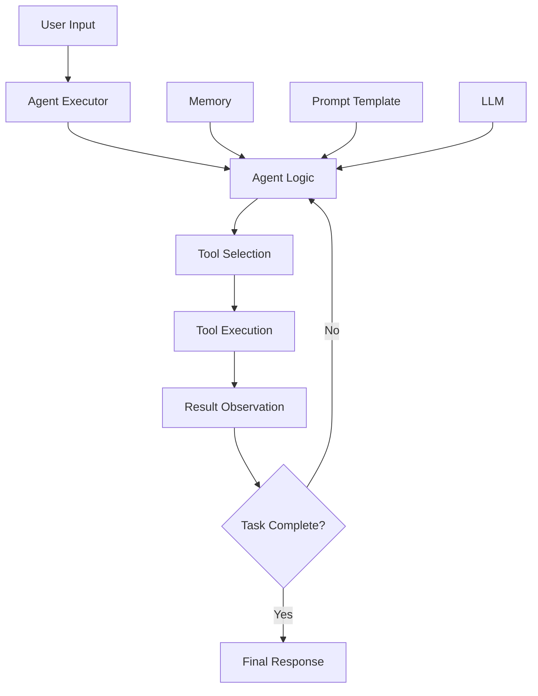

# LangChain Agent Development Guide

This comprehensive guide covers everything you need to know about developing production-ready LangChain agents using this template.

## Table of Contents

1. [Agent Architecture Overview](#agent-architecture-overview)
2. [Quick Start Guide](#quick-start-guide)
3. [Agent Components Deep Dive](#agent-components-deep-dive)
4. [Production Implementation Patterns](#production-implementation-patterns)
5. [Tool Development](#tool-development)
6. [Memory Management](#memory-management)
7. [Error Handling & Resilience](#error-handling--resilience)
8. [Testing Strategies](#testing-strategies)
9. [Performance Optimization](#performance-optimization)
10. [Deployment Considerations](#deployment-considerations)
11. [Troubleshooting](#troubleshooting)

## Agent Architecture Overview

### What are LangChain Agents?

LangChain agents are AI systems that can reason about which tools to use and how to use them to accomplish tasks. They follow the ReAct (Reasoning and Acting) pattern:

- **Reasoning**: The agent thinks about what it needs to do
- **Acting**: The agent takes action using available tools
- **Observing**: The agent observes the results and decides next steps

### Core Components



## Quick Start Guide

### 1. Basic Agent Setup

```python
from langchain_context_engineering.chains import AgentChain, AgentChainConfig
from langchain_context_engineering.tools import CalculatorTool
from langchain.tools import Tool

# Create configuration
config = AgentChainConfig(
    model_provider="openai",
    model_name="gpt-3.5-turbo",
    temperature=0.1,
    max_iterations=5,
    verbose=True
)

# Create tools
calculator = CalculatorTool()
search_tool = Tool(
    name="search",
    description="Search for information",
    func=lambda query: f"Search results for: {query}"
)

# Create agent
agent = AgentChain(
    config=config,
    tools=[calculator, search_tool],
    system_prompt="You are a helpful research assistant."
)

# Use the agent
result = agent.run("What is 25 * 17 and can you search for information about it?")
print(result.response)
print(f"Tools used: {result.tools_used}")
print(f"Iterations: {result.iterations_used}")
```

### 2. Using the Template's Agent Example

```python
# Run the comprehensive agent example
python examples/agent_chain.py

# This demonstrates:
# - Multiple tool integration
# - ReAct reasoning pattern
# - Memory management
# - Error handling
# - Custom tool creation
```

## Agent Components Deep Dive

### 1. Agent Executor Configuration

The `AgentExecutor` is the central component that orchestrates agent behavior:

```python
from langchain.agents import AgentExecutor, create_openai_tools_agent

# Key configuration options
agent_executor = AgentExecutor(
    agent=agent,
    tools=tools,
    memory=memory,
    verbose=True,                      # Show reasoning steps
    max_iterations=10,                 # Prevent infinite loops
    max_execution_time=120,            # Timeout in seconds
    handle_parsing_errors=True,        # Graceful error handling
    return_intermediate_steps=True,    # Return reasoning chain
    early_stopping_method="generate"   # Stop when final answer generated
)
```

### 2. Prompt Engineering for Agents

Effective agent prompts should include:

```python
agent_prompt = ChatPromptTemplate.from_messages([
    ("system", """You are a helpful AI assistant with access to tools.

GUIDELINES:
- Think step by step about what you need to do
- Use tools when you need external information or to perform actions
- Be precise and accurate in your responses
- If you're unsure, say so rather than guessing
- Break down complex tasks into smaller steps

IMPORTANT:
- Always use the exact tool names provided
- Follow the specified input format for each tool
- Don't make up tool results - use actual tool outputs"""),
    
    ("placeholder", "{chat_history}"),
    ("human", "{input}"),
    ("placeholder", "{agent_scratchpad}"),
])
```

### 3. Tool Integration Patterns

#### Standard Tool Integration

```python
from langchain_core.tools import BaseTool
from pydantic import Field

class CustomTool(BaseTool):
    name: str = "custom_tool"
    description: str = "Description of what this tool does"
    
    def _run(self, input_param: str) -> str:
        # Tool implementation
        return f"Result for {input_param}"
    
    async def _arun(self, input_param: str) -> str:
        # Async implementation
        return await async_operation(input_param)
```

#### Tool with Input Schema

```python
from pydantic import BaseModel

class ToolInput(BaseModel):
    query: str = Field(description="The search query")
    max_results: int = Field(default=5, description="Maximum results")

class SearchTool(BaseTool):
    name: str = "search"
    description: str = "Search for information"
    args_schema: Type[BaseModel] = ToolInput
    
    def _run(self, query: str, max_results: int = 5) -> str:
        # Implementation with typed parameters
        return perform_search(query, max_results)
```

## Production Implementation Patterns

### 1. Robust Agent Configuration

```python
from langchain_context_engineering.chains import AgentChain, AgentChainConfig

class ProductionAgentConfig(AgentChainConfig):
    """Production-ready agent configuration."""
    
    # Reliability settings
    max_iterations: int = 15
    max_execution_time: int = 300  # 5 minutes
    timeout: int = 30
    max_retries: int = 3
    
    # Memory settings
    memory_type: str = "buffer_window"
    memory_window_size: int = 20
    redis_url: str = "redis://localhost:6379"
    
    # Security settings
    allow_dangerous_tools: bool = False
    sanitize_inputs: bool = True
    
    # Performance settings
    temperature: float = 0.1  # More deterministic
    max_tokens: int = 2000
    
    # Monitoring
    enable_tracing: bool = True
    log_level: str = "INFO"

def create_production_agent(tools: List[BaseTool]) -> AgentChain:
    """Create a production-ready agent with proper configuration."""
    
    config = ProductionAgentConfig()
    
    system_prompt = """You are a production AI assistant. Follow these principles:

RELIABILITY:
- Always validate inputs before processing
- Handle errors gracefully and provide helpful error messages
- Use tools conservatively and verify results
- If a task seems impossible or dangerous, decline politely

SECURITY:
- Never execute dangerous commands
- Validate all user inputs
- Don't access sensitive information without authorization
- Report suspicious requests

PERFORMANCE:
- Be efficient in tool usage
- Avoid unnecessary iterations
- Provide concise but complete responses
- Cache results when appropriate"""
    
    return AgentChain(
        config=config,
        tools=tools,
        system_prompt=system_prompt
    )
```

### 2. Agent Factory Pattern

```python
from typing import Dict, List, Type
from enum import Enum

class AgentType(Enum):
    RESEARCH = "research"
    CODING = "coding"
    DATA_ANALYSIS = "data_analysis"
    CUSTOMER_SERVICE = "customer_service"

class AgentFactory:
    """Factory for creating specialized agents."""
    
    @staticmethod
    def create_research_agent() -> AgentChain:
        """Create an agent specialized for research tasks."""
        tools = [
            WebSearchTool(),
            DocumentReaderTool(),
            SummarizerTool()
        ]
        
        config = AgentChainConfig(
            model_name="gpt-4",
            temperature=0.1,
            max_iterations=10
        )
        
        system_prompt = """You are a research assistant specializing in finding and analyzing information.
        
        Your capabilities:
        - Web search for current information
        - Document analysis and summarization
        - Fact verification and source citation
        
        Always provide sources for your information and indicate confidence levels."""
        
        return AgentChain(config=config, tools=tools, system_prompt=system_prompt)
    
    @staticmethod
    def create_coding_agent() -> AgentChain:
        """Create an agent specialized for coding tasks."""
        tools = [
            CodeExecutorTool(),
            DocumentationSearchTool(),
            GitTool(),
            FileManagerTool()
        ]
        
        config = AgentChainConfig(
            model_name="gpt-4",
            temperature=0.0,  # More deterministic for code
            max_iterations=15
        )
        
        system_prompt = """You are a coding assistant with expertise in software development.
        
        Your capabilities:
        - Code execution and testing
        - Documentation lookup
        - Git operations
        - File management
        
        Always write clean, well-commented code and test your solutions."""
        
        return AgentChain(config=config, tools=tools, system_prompt=system_prompt)
    
    @classmethod
    def create_agent(cls, agent_type: AgentType) -> AgentChain:
        """Create an agent of the specified type."""
        creators = {
            AgentType.RESEARCH: cls.create_research_agent,
            AgentType.CODING: cls.create_coding_agent,
            # Add more agent types as needed
        }
        
        if agent_type not in creators:
            raise ValueError(f"Unknown agent type: {agent_type}")
        
        return creators[agent_type]()

# Usage
research_agent = AgentFactory.create_agent(AgentType.RESEARCH)
coding_agent = AgentFactory.create_agent(AgentType.CODING)
```

## Tool Development

### 1. Custom Tool Implementation

```python
from langchain_context_engineering.tools import BaseTool
import httpx
import asyncio

class WeatherTool(BaseTool):
    """Tool for getting weather information."""
    
    name: str = "weather"
    description: str = "Get current weather information for a location"
    api_key: str = Field(..., description="Weather API key")
    
    def _validate_input_safety(self, input_str: str) -> bool:
        """Override to add tool-specific validation."""
        if not super()._validate_input_safety(input_str):
            return False
        
        # Check for valid location format
        if len(input_str.strip()) < 2:
            return False
            
        return True
    
    def _execute(self, location: str) -> str:
        """Get weather for the specified location."""
        try:
            # Mock implementation - replace with actual API call
            weather_data = {
                "new york": "Sunny, 72°F",
                "london": "Cloudy, 15°C", 
                "tokyo": "Rainy, 18°C"
            }
            
            location_lower = location.lower()
            if location_lower in weather_data:
                return f"Weather in {location}: {weather_data[location_lower]}"
            else:
                return f"Weather data not available for {location}"
                
        except Exception as e:
            return f"Error getting weather data: {str(e)}"
    
    async def _aexecute(self, location: str) -> str:
        """Async implementation with actual API call."""
        try:
            async with httpx.AsyncClient() as client:
                response = await client.get(
                    f"https://api.weather.com/v1/current",
                    params={"location": location, "key": self.api_key},
                    timeout=10.0
                )
                response.raise_for_status()
                data = response.json()
                
                return f"Weather in {location}: {data['condition']}, {data['temperature']}"
                
        except httpx.TimeoutError:
            return f"Weather API request timed out for {location}"
        except Exception as e:
            return f"Error getting weather data: {str(e)}"
```

### 2. Tool Composition and Chaining

```python
class CompositeResearchTool(BaseTool):
    """Tool that combines multiple research operations."""
    
    name: str = "comprehensive_research"
    description: str = "Perform comprehensive research on a topic"
    
    def __init__(self, **kwargs):
        super().__init__(**kwargs)
        self.search_tool = WebSearchTool()
        self.summarizer_tool = SummarizerTool()
        self.fact_checker_tool = FactCheckerTool()
    
    def _execute(self, topic: str) -> str:
        """Perform multi-step research process."""
        try:
            # Step 1: Search for information
            search_results = self.search_tool._execute(topic)
            
            # Step 2: Summarize findings
            summary = self.summarizer_tool._execute(search_results)
            
            # Step 3: Fact-check key claims
            fact_check = self.fact_checker_tool._execute(summary)
            
            return f"""Research Results for: {topic}

SUMMARY:
{summary}

FACT CHECK:
{fact_check}

SOURCES:
{search_results}"""
            
        except Exception as e:
            return f"Research failed: {str(e)}"
```

## Memory Management

### 1. Conversation Memory

```python
from langchain.memory import ConversationBufferWindowMemory
from langchain_community.chat_message_histories import RedisChatMessageHistory

def create_persistent_memory(session_id: str, redis_url: str) -> ConversationBufferWindowMemory:
    """Create memory with Redis persistence."""
    
    message_history = RedisChatMessageHistory(
        url=redis_url,
        session_id=session_id,
        ttl=3600  # 1 hour TTL
    )
    
    return ConversationBufferWindowMemory(
        k=20,  # Remember last 20 exchanges
        chat_memory=message_history,
        memory_key="chat_history",
        return_messages=True,
        output_key="output",
        input_key="input"
    )
```

### 2. Context-Aware Memory

```python
class ContextAwareMemory:
    """Memory that maintains context across sessions."""
    
    def __init__(self, redis_url: str):
        self.redis_url = redis_url
        self.sessions = {}
    
    def get_memory_for_user(self, user_id: str, session_id: str) -> ConversationBufferWindowMemory:
        """Get memory for specific user and session."""
        
        key = f"{user_id}:{session_id}"
        
        if key not in self.sessions:
            message_history = RedisChatMessageHistory(
                url=self.redis_url,
                session_id=key,
                ttl=24*3600  # 24 hour TTL
            )
            
            self.sessions[key] = ConversationBufferWindowMemory(
                k=30,
                chat_memory=message_history,
                memory_key="chat_history",
                return_messages=True
            )
        
        return self.sessions[key]
    
    def clear_user_memory(self, user_id: str):
        """Clear all memory for a user."""
        keys_to_remove = [k for k in self.sessions.keys() if k.startswith(f"{user_id}:")]
        
        for key in keys_to_remove:
            self.sessions[key].clear()
            del self.sessions[key]
```

## Error Handling & Resilience

### 1. Graceful Degradation

```python
class ResilientAgent(AgentChain):
    """Agent with enhanced error handling and fallback strategies."""
    
    def __init__(self, *args, **kwargs):
        super().__init__(*args, **kwargs)
        self.fallback_responses = {
            "tool_failure": "I encountered an issue with one of my tools, but I can try a different approach.",
            "timeout": "This task is taking longer than expected. Let me provide a partial response.",
            "parse_error": "I had trouble understanding the tool output, but here's what I gathered."
        }
    
    def _handle_tool_error(self, tool_name: str, error: str) -> str:
        """Handle tool execution errors gracefully."""
        
        self.logger.warning(f"Tool {tool_name} failed: {error}")
        
        # Try alternative tools if available
        alternative_tools = self._get_alternative_tools(tool_name)
        
        if alternative_tools:
            return f"The {tool_name} tool is currently unavailable, but I can use {alternative_tools[0]} instead."
        else:
            return self.fallback_responses["tool_failure"]
    
    def _get_alternative_tools(self, failed_tool: str) -> List[str]:
        """Get alternative tools for common functionality."""
        
        alternatives = {
            "web_search": ["document_search", "knowledge_base"],
            "calculator": ["math_tool", "computation_tool"],
            "file_reader": ["document_reader", "text_extractor"]
        }
        
        return alternatives.get(failed_tool, [])
```

### 2. Circuit Breaker Pattern

```python
from datetime import datetime, timedelta
from typing import Dict

class CircuitBreaker:
    """Circuit breaker for tool reliability."""
    
    def __init__(self, failure_threshold: int = 5, timeout: int = 60):
        self.failure_threshold = failure_threshold
        self.timeout = timeout
        self.failure_count: Dict[str, int] = {}
        self.last_failure: Dict[str, datetime] = {}
        self.circuit_open: Dict[str, bool] = {}
    
    def is_circuit_open(self, tool_name: str) -> bool:
        """Check if circuit is open for a tool."""
        
        if tool_name not in self.circuit_open:
            return False
        
        if not self.circuit_open[tool_name]:
            return False
        
        # Check if timeout has passed
        if tool_name in self.last_failure:
            time_since_failure = datetime.now() - self.last_failure[tool_name]
            if time_since_failure > timedelta(seconds=self.timeout):
                # Reset circuit
                self.circuit_open[tool_name] = False
                self.failure_count[tool_name] = 0
                return False
        
        return True
    
    def record_success(self, tool_name: str):
        """Record successful tool execution."""
        self.failure_count[tool_name] = 0
        self.circuit_open[tool_name] = False
    
    def record_failure(self, tool_name: str):
        """Record failed tool execution."""
        self.failure_count[tool_name] = self.failure_count.get(tool_name, 0) + 1
        self.last_failure[tool_name] = datetime.now()
        
        if self.failure_count[tool_name] >= self.failure_threshold:
            self.circuit_open[tool_name] = True
```

## Testing Strategies

### 1. Agent Testing Framework

```python
import pytest
from unittest.mock import Mock, patch
from langchain_context_engineering.chains import AgentChain, AgentChainConfig

class AgentTestFramework:
    """Framework for testing agent behavior."""
    
    @staticmethod
    def create_test_agent(tools: List[BaseTool] = None) -> AgentChain:
        """Create an agent for testing."""
        
        if tools is None:
            tools = [Mock(name="mock_tool")]
        
        config = AgentChainConfig(
            model_provider="openai",
            model_name="gpt-3.5-turbo",
            temperature=0.0,  # Deterministic for testing
            max_iterations=3,  # Limit for faster tests
            verbose=False
        )
        
        return AgentChain(config=config, tools=tools)
    
    @staticmethod
    def mock_llm_response(response_text: str):
        """Mock LLM responses for testing."""
        return patch('langchain_openai.ChatOpenAI.invoke', return_value=response_text)

# Test cases
class TestAgentBehavior:
    
    def test_agent_creation(self):
        """Test agent can be created successfully."""
        agent = AgentTestFramework.create_test_agent()
        assert agent is not None
        assert len(agent.tools) > 0
    
    def test_single_tool_usage(self):
        """Test agent uses tools correctly."""
        mock_tool = Mock()
        mock_tool.name = "test_tool"
        mock_tool._run.return_value = "Tool executed successfully"
        
        agent = AgentTestFramework.create_test_agent([mock_tool])
        
        with AgentTestFramework.mock_llm_response("I'll use the test_tool"):
            result = agent.run("Test query")
            
            assert result.success
            assert "test_tool" in result.tools_used
    
    def test_error_handling(self):
        """Test agent handles tool errors gracefully."""
        failing_tool = Mock()
        failing_tool.name = "failing_tool"
        failing_tool._run.side_effect = Exception("Tool failed")
        
        agent = AgentTestFramework.create_test_agent([failing_tool])
        
        result = agent.run("This should fail")
        
        # Agent should handle error gracefully
        assert result.success or "error" in result.response.lower()
    
    def test_iteration_limits(self):
        """Test agent respects iteration limits."""
        agent = AgentTestFramework.create_test_agent()
        
        result = agent.run("Complex task requiring many steps")
        
        assert result.iterations_used <= agent.agent_config.max_iterations
```

### 2. Integration Testing

```python
class TestAgentIntegration:
    """Integration tests for agent functionality."""
    
    @pytest.fixture
    def real_agent(self):
        """Create agent with real tools for integration testing."""
        from langchain_context_engineering.tools import CalculatorTool
        
        config = AgentChainConfig(
            model_provider="openai", 
            max_iterations=5,
            verbose=True
        )
        
        return AgentChain(
            config=config,
            tools=[CalculatorTool()]
        )
    
    def test_calculator_integration(self, real_agent):
        """Test calculator tool integration."""
        result = real_agent.run("What is 25 * 17?")
        
        assert result.success
        assert "425" in result.response
        assert "calculator" in result.tools_used
    
    def test_multi_step_reasoning(self, real_agent):
        """Test multi-step problem solving."""
        result = real_agent.run("Calculate 15% tip on a $120 bill")
        
        assert result.success
        assert result.iterations_used > 1  # Should require multiple steps
        assert any(keyword in result.response.lower() for keyword in ["18", "$18", "18.0"])
```

## Performance Optimization

### 1. Async Agent Implementation

```python
class AsyncAgentChain(AgentChain):
    """Async-optimized agent implementation."""
    
    async def arun_parallel_tools(self, queries: List[str]) -> List[AgentOutput]:
        """Run multiple queries in parallel."""
        
        tasks = [self.arun(query) for query in queries]
        results = await asyncio.gather(*tasks, return_exceptions=True)
        
        # Handle exceptions in results
        processed_results = []
        for i, result in enumerate(results):
            if isinstance(result, Exception):
                processed_results.append(AgentOutput(
                    response=f"Error processing query {i}: {str(result)}",
                    success=False,
                    error=str(result)
                ))
            else:
                processed_results.append(result)
        
        return processed_results
    
    async def arun_with_timeout(self, query: str, timeout: int = 60) -> AgentOutput:
        """Run agent with explicit timeout."""
        try:
            return await asyncio.wait_for(self.arun(query), timeout=timeout)
        except asyncio.TimeoutError:
            return AgentOutput(
                response="Agent execution timed out",
                success=False,
                error=f"Execution exceeded {timeout} seconds"
            )
```

### 2. Caching and Optimization

```python
from functools import lru_cache
import hashlib

class CachedAgent(AgentChain):
    """Agent with result caching."""
    
    def __init__(self, *args, **kwargs):
        super().__init__(*args, **kwargs)
        self.cache = {}
        self.cache_hits = 0
        self.cache_misses = 0
    
    def _get_cache_key(self, query: str) -> str:
        """Generate cache key for query."""
        return hashlib.md5(query.encode()).hexdigest()
    
    def run(self, input_data) -> AgentOutput:
        """Run with caching."""
        
        # Convert input to string for caching
        if isinstance(input_data, str):
            query = input_data
        else:
            query = input_data.query if hasattr(input_data, 'query') else str(input_data)
        
        cache_key = self._get_cache_key(query)
        
        # Check cache
        if cache_key in self.cache:
            self.cache_hits += 1
            self.logger.debug(f"Cache hit for query: {query[:50]}...")
            return self.cache[cache_key]
        
        # Execute normally
        self.cache_misses += 1
        result = super().run(input_data)
        
        # Cache successful results
        if result.success:
            self.cache[cache_key] = result
        
        return result
    
    def get_cache_stats(self) -> Dict[str, Any]:
        """Get caching statistics."""
        total_requests = self.cache_hits + self.cache_misses
        hit_rate = self.cache_hits / total_requests if total_requests > 0 else 0
        
        return {
            "cache_hits": self.cache_hits,
            "cache_misses": self.cache_misses,
            "hit_rate": hit_rate,
            "cache_size": len(self.cache)
        }
```

## Deployment Considerations

### 1. Production Deployment Checklist

- [ ] **Environment Configuration**
  - API keys properly secured
  - Environment variables configured
  - Logging levels appropriate for production
  
- [ ] **Resource Management**
  - Memory limits configured
  - Timeout values set appropriately
  - Connection pooling enabled
  
- [ ] **Monitoring & Observability**
  - LangSmith tracing enabled
  - Metrics collection configured
  - Error alerting set up
  
- [ ] **Security**
  - Input validation enabled
  - Dangerous tools disabled
  - Rate limiting implemented
  
- [ ] **Reliability**
  - Circuit breakers configured
  - Retry logic implemented
  - Graceful degradation tested

### 2. Docker Deployment

```dockerfile
# Dockerfile for agent deployment
FROM python:3.11-slim

WORKDIR /app

# Install dependencies
COPY requirements.txt .
RUN pip install -r requirements.txt

# Copy application code
COPY . .

# Set environment variables
ENV PYTHONPATH=/app
ENV LOG_LEVEL=INFO

# Health check
HEALTHCHECK --interval=30s --timeout=10s --start-period=5s --retries=3 \
  CMD python -c "from chains import AgentChain; print('OK')"

# Run application
CMD ["python", "-m", "uvicorn", "api:app", "--host", "0.0.0.0", "--port", "8000"]
```

### 3. Kubernetes Deployment

```yaml
# agent-deployment.yaml
apiVersion: apps/v1
kind: Deployment
metadata:
  name: langchain-agent
spec:
  replicas: 3
  selector:
    matchLabels:
      app: langchain-agent
  template:
    metadata:
      labels:
        app: langchain-agent
    spec:
      containers:
      - name: agent
        image: langchain-agent:latest
        ports:
        - containerPort: 8000
        env:
        - name: OPENAI_API_KEY
          valueFrom:
            secretKeyRef:
              name: api-secrets
              key: openai-key
        - name: REDIS_URL
          value: "redis://redis-service:6379"
        resources:
          requests:
            memory: "512Mi"
            cpu: "250m"
          limits:
            memory: "1Gi"
            cpu: "500m"
        livenessProbe:
          httpGet:
            path: /health
            port: 8000
          initialDelaySeconds: 30
          periodSeconds: 10
        readinessProbe:
          httpGet:
            path: /ready
            port: 8000
          initialDelaySeconds: 5
          periodSeconds: 5
```

## Troubleshooting

### Common Issues and Solutions

#### 1. Agent Not Using Tools

**Symptoms**: Agent provides responses without using available tools

**Solutions**:
- Check tool descriptions are clear and specific
- Verify tool names don't conflict
- Ensure prompt includes tool usage instructions
- Reduce temperature for more deterministic behavior

```python
# Better tool description
tool = Tool(
    name="calculator",
    description="Use this for mathematical calculations. Input should be a mathematical expression like '2+2' or '15*3'. Always use this for any math problem.",
    func=calculate
)
```

#### 2. Infinite Loops or Excessive Iterations

**Symptoms**: Agent keeps iterating without reaching a conclusion

**Solutions**:
- Set appropriate `max_iterations` limit
- Improve stopping criteria in prompts
- Add explicit "Final Answer" formatting
- Check for circular tool dependencies

```python
config = AgentChainConfig(
    max_iterations=5,  # Prevent runaway agents
    max_execution_time=60  # Hard timeout
)
```

#### 3. Memory Issues

**Symptoms**: Agent doesn't remember previous interactions

**Solutions**:
- Verify memory configuration
- Check Redis connection if using persistent memory
- Ensure memory key matches agent configuration
- Monitor memory window size

```python
# Debug memory
print(f"Memory contents: {agent.memory.load_memory_variables({})}")
```

#### 4. Tool Execution Failures

**Symptoms**: Tools return errors or fail silently

**Solutions**:
- Add comprehensive error handling in tools
- Implement input validation
- Use circuit breaker pattern for unreliable tools
- Add logging to tool execution

```python
class RobustTool(BaseTool):
    def _run(self, input_text: str) -> str:
        try:
            # Input validation
            if not self._validate_input_safety(input_text):
                return "Error: Invalid input"
            
            # Tool execution
            result = self._execute_tool(input_text)
            return result
            
        except Exception as e:
            self.logger.error(f"Tool execution failed: {e}")
            return f"Tool temporarily unavailable: {str(e)}"
```

### Debugging Techniques

#### 1. Enable Verbose Logging

```python
config = AgentChainConfig(verbose=True, log_level="DEBUG")
```

#### 2. Inspect Intermediate Steps

```python
result = agent.run("Your query")
for i, step in enumerate(result.intermediate_steps):
    print(f"Step {i+1}: {step}")
```

#### 3. Monitor Token Usage

```python
# Add token counting to your agent
class TokenCountingAgent(AgentChain):
    def __init__(self, *args, **kwargs):
        super().__init__(*args, **kwargs)
        self.total_tokens = 0
    
    def run(self, input_data) -> AgentOutput:
        result = super().run(input_data)
        
        # Log token usage (implement based on your LLM provider)
        if hasattr(result, 'token_usage'):
            self.total_tokens += result.token_usage.get('total', 0)
            print(f"Tokens used: {result.token_usage}")
        
        return result
```

This comprehensive guide should provide everything needed to develop robust, production-ready LangChain agents using this template. For specific implementation details, refer to the examples in the `examples/` directory and the production-ready components in the `chains/` and `tools/` directories.